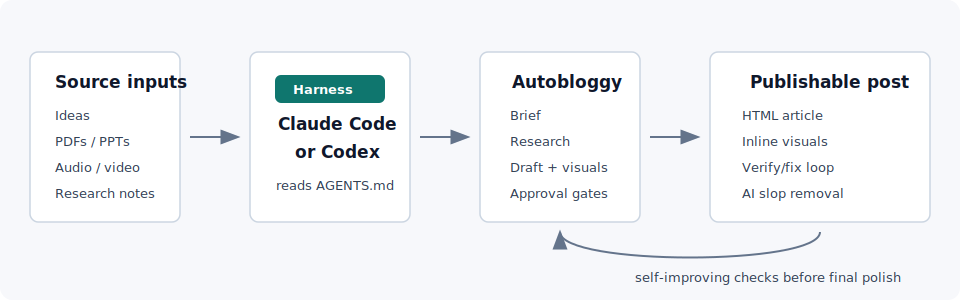

# Autobloggy

Turn ideas, research, and existing assets into **publishable blogs and guides** without starting from a blank page.

Autobloggy is meant to be run inside a coding-agent harness such as **Claude Code** or **Codex**. It gives that agent a controlled editorial workflow for creating new content or repurposing **PDFs**, **slide decks**, **notes**, **interviews**, **audio**, and **video** into finished HTML posts.



Use it when you need to:

- **Create from scratch** with a clear angle, outline, evidence plan, and visual plan.
- **Repurpose source material** into readable content without losing the useful substance.
- **Include visuals**: charts, diagrams, callouts, and inline article graphics.
- **Add research before drafting** instead of polishing a shallow first pass.
- **Improve the draft automatically** with a verify/fix loop for gaps, structure, layout, and quality criteria.
- **Remove AI slop** so the final draft sounds less generic and more publishable.

You provide the direction and source material. The agent drafts the brief, asks for approval, writes the post, adds visuals, checks its own work, and cleans up the prose.

## Install

```bash
./scripts/install.sh
```

Installs Python deps, the Playwright Chromium browser used during verification, and agent skill copies.

## Agent Support

Autobloggy works with **Claude Code** and `AGENTS.md` compatible coding-agent harnesses. The largest `AGENTS.md` target is **Codex from OpenAI**, but the same repo instructions are meant for other compatible agents too, including Amp, Jules from Google, Cursor, Factory, RooCode, Aider, Gemini CLI from Google, goose, Kilo Code, opencode, Phoenix, Zed, Semgrep, Warp, GitHub Copilot Coding Agent, VS Code, Ona, Devin from Cognition, Windsurf from Cognition, UiPath Autopilot & Coded Agents, Augment Code, and Junie from JetBrains.

`AGENTS.md` and `CLAUDE.md` are bootstrap indexes. `program.md` is the workflow authority once an agent starts work.

## Usage

Ask the agent in plain English:

```text
Let's write a [guide|blog] post about [topic] using the [fast|guided|expert] intake.
```

To include source material, drop files into a folder and mention them, or pass paths — the agent will copy them into `posts/<slug>/inputs/raw/` and prepare normalized versions alongside.

From there the agent will:

1. Run prep and draft `blog_brief.md`
2. Hand it to you to review (angle, outline, evidence, required points, things to avoid, visual plan)
3. On your approval, generate the draft scaffold and write the first draft into `posts/<slug>/draft.html`
4. Run the verify/fix loop until no automated or manually inserted feedback  `<!-- fb[...] -->` markers remain (guided from the `quality_criteria.md` file)
5. Finish with a `slop-mop` pass to remove generic AI-sounding prose

You add image/chart requests directly to `blog_brief.md` before approving — the first-draft step authors them inline.

## Intake Depths

How much the agent asks before drafting:

- **fast** — agent fills the brief from topic and sources. Discovery skipped.
- **guided** — you answer the strategic questions, agent fills the rest.
- **expert** — you drive most substantive decisions.

`guided` and `expert` need `--select audience=...` and `--select format=...` (the agent will ask).

## Presets

A preset is a reusable editorial pack — brand voice, writing rules, HTML template, audience, and format options. The default preset supports:

- `audience`: `general`, `practitioner`, `decision-maker`
- `format`: `blog`, `guide`

Make a new one:

```bash
uv run autobloggy new-preset --name acme
```

Defaults (preset, intake depth, brief sections, verify viewport widths) live in `config.yaml`.

## Where Things Live

| Path | Purpose |
|------|---------|
| `posts/<slug>/blog_brief.md` | The one pre-draft approval artifact |
| `posts/<slug>/draft.html` | Working draft; loop edits happen inside `<main>` |
| `posts/<slug>/inputs/raw/` | Your original source files (only put originals here) |
| `posts/<slug>/inputs/prepared/` | Normalized LLM-readable copies (system-owned) |
| `posts/<slug>/meta.yaml` | Pipeline state |
| `presets/<name>/` | Editorial packs |
| `program.md` | Authoritative workflow for agents |

## CLI

Mostly run by the agent, but available to you:

- `prep` — scaffold a post, ingest sources, draft `blog_brief.md`
- `approve-brief` — validate the brief and mark it approved
- `generate-draft` — materialize `draft.html` from the template
- `verify` — run programmatic checks and capture screenshots into `.verify/`
- `new-preset` — copy `presets/default/` to a new preset folder

`uv run autobloggy --help` for flags.
